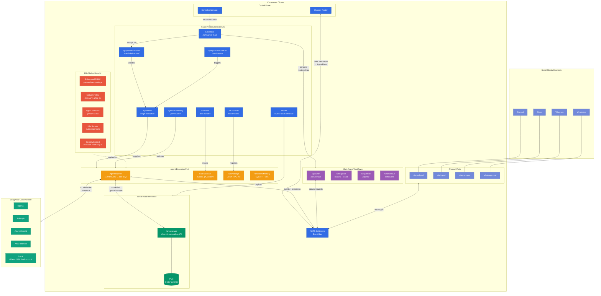

# Sympozium — Simplified Architecture

## Key Callouts

### Multi-Agent Workflows
Ensembles define **persona relationships** — directed edges between agents with three workflow types:
- **Delegation** — agent A spawns agent B, awaits result
- **Sequential** — ordered pipeline execution across personas
- **Autonomous** — independent cron-scheduled execution

The **Spawner** orchestrates runtime delegation via the NATS event bus, validating relationships before allowing cross-agent calls.

### Kubernetes-Native Primitives & Security
Every component is a **CRD** reconciled by standard controllers:
- **Ephemeral RBAC** — per-run Role/RoleBinding with least-privilege, auto-deleted on completion
- **NetworkPolicy** — deny-all default + explicit allow-list for DNS, event bus, and external APIs
- **Agent Sandbox** — optional gVisor/Kata kernel isolation via the `agent-sandbox` CRD
- **SecurityContext** — non-root, read-only root filesystem, dropped capabilities
- **K8s Secrets** — auth credentials mounted as volumes, never embedded in CRD specs

### Bring Your Own Provider
A single **`LLMProvider` interface** (`Chat`, `AddToolResults`, `Name`, `Model`) abstracts all backends:
- Cloud: OpenAI, Anthropic, Azure OpenAI, AWS Bedrock
- Local: Ollama, LM Studio, vLLM, llama-server

Configured per-agent via `ModelSpec` — just set `provider`, `model`, and point an `authSecretRef` at a K8s Secret.

### Cluster-Local Model Inference
The **`Model` CRD** makes local inference declarative — apply a Model and the controller handles everything:
- Downloads GGUF weights to a PVC
- Deploys a llama-server with GPU resources
- Exposes an OpenAI-compatible endpoint as a ClusterIP Service
- AgentRuns reference models via `modelRef` — no API key needed

Models appear automatically as provider options in the web UI onboarding wizard. Deploy via `kubectl apply`, the web UI, or Helm values.
