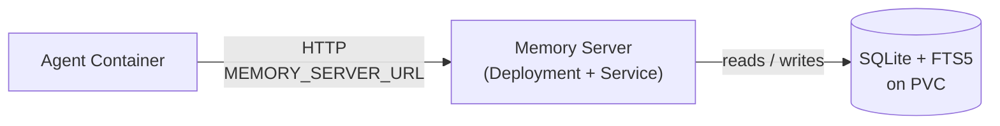
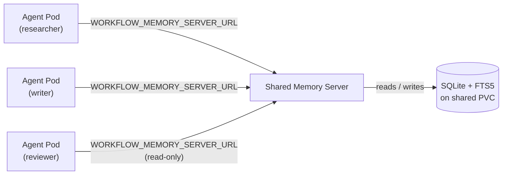

# Persistent Memory

Each `Agent` can enable **persistent memory** — a SQLite database with FTS5 full-text search, served by a per-Agent memory server (a Deployment and Service next to the agent pods). The database lives on a PersistentVolume, so memory survives across ephemeral agent runs.

Agents interact with memory through these tools, which the agent-runner serves by calling the memory server over HTTP:

| Tool | Description |
|------|-------------|
| `memory_search(query, top_k?)` | Full-text search across stored memories. Returns the top _k_ results (default 10). |
| `memory_store(content, tags?)` | Store a new memory entry with optional tags for categorisation. |
| `memory_list(tags?, limit?)` | List memories, optionally filtered by tags. |
| `memory_update(id, content, tags?)` | Replace an entry with corrected content. Only the new version appears in search and list. |
| `memory_forget(id)` | Remove an entry from search and list. |

## How It Works

1. Attaching the `memory` SkillPack makes the controller create a **memory server** for the Agent: a Deployment `<agent>-memory` (the `skill-memory` image, `cmd/memory-server/`), a Service of the same name on port 8080, and a PVC `<agent>-memory-db` holding `memory.v2.db`, the SQLite database. (Releases before update/forget used `memory.db`; see [Upgrading and rolling back](#upgrading-and-rolling-back).)
2. Each AgentRun's agent container receives `MEMORY_SERVER_URL` (`http://<agent>-memory.<namespace>.svc:8080`); the memory tools call it over HTTP.
3. SQLite FTS5 indexes all stored content for fast full-text search.
4. Because the server and its PVC outlive individual runs, memories persist across runs.


```mermaid
graph LR
    A["Agent Container"] -- "HTTP<br/>MEMORY_SERVER_URL" --> M["Memory Server<br/>(Deployment + Service)"]
    M -- "reads / writes" --> DB[("SQLite + FTS5<br/>on PVC")]
```

## Automatic Memory Storage

When the `memory` SkillPack is attached, the agent-runner **automatically stores a summary of every successful run** — a truncated `Task: … / Response: …` entry tagged `auto` and `agent-run` — so future runs have context without the agent having to call `memory_store` explicitly.

### Opting out

Some teams prefer to curate memory deliberately rather than log every run. Set `autoStore: false` to disable the automatic write while **keeping the memory skill and its `memory_store` tool** for manual/curated entries — only the automatic per-run write stops.

On a single `Agent`:

```yaml
apiVersion: sympozium.ai/v1alpha1
kind: Agent
metadata:
  name: my-agent
spec:
  skills:
    - skillPackRef: memory
  memory:
    autoStore: false   # keep the skill, stop the automatic per-run write
```

On an `Ensemble` — `autoStoreMemory` sets the team-wide default, overridable per member via `agentConfigs[].memory.autoStore`:

```yaml
apiVersion: sympozium.ai/v1alpha1
kind: Ensemble
metadata:
  name: research-team
spec:
  autoStoreMemory: false        # default for every generated agent
  agentConfigs:
    - name: archivist
      memory:
        autoStore: true          # this member still auto-stores (overrides the default)
```

Precedence: per-agent-config `memory.autoStore` → ensemble `autoStoreMemory` → default (`true`). Omitting the field everywhere preserves the existing auto-store behaviour.

### Tuning truncation limits

Auto-stored entries are truncated to keep the database small. The byte limits default to **500 bytes** (task) and **1000 bytes** (response) and can be overridden per pod via environment variables (set through `spec.agents.default.env` on the Agent, or `env` on an ensemble agent-config):

| Env var | Default | Effect |
|---------|---------|--------|
| `MEMORY_AUTO_STORE_MAX_TASK_BYTES` | `500` | Max stored bytes of the task; a value ≤ 0 disables task truncation |
| `MEMORY_AUTO_STORE_MAX_RESPONSE_BYTES` | `1000` | Max stored bytes of the response; a value ≤ 0 disables response truncation |
| `MEMORY_AUTO_STORE` | `true` | Set to `false` to disable auto-store directly (the controller sets this from `memory.autoStore`) |

Setting `MEMORY_AUTO_STORE` yourself through `spec.agents.default.env` (or an ensemble agent-config's `env`) also works, and an explicit env var wins over `memory.autoStore` — the controller skips its own injection when the pod already carries the variable. That matches every other controller-injected variable (`RUN_TIMEOUT`, `MEMORY_SERVER_URL`, and so on): `spec.env` is the last word. Prefer `memory.autoStore` for anything declarative, since the env var is per-pod and invisible to the Agent/Ensemble spec.

## Correcting and Forgetting

Memory storage is **append-only**. A stored row is never changed. Each row is one **version** of a memory:

- `id` is the memory's id. It is shared by all versions, so an agent keeps using the same id after an update.
- `seq` is a global, always-increasing sequence number. The version with the highest `seq` for an `id` is the **current version**.
- `content` is `NULL` for a forget.

The tools add versions:

- `memory_update(id, content, tags?)` adds a version with the new content.
- `memory_forget(id)` adds a version with `NULL` content.

Search, list and provenance only see the current version of each memory, and only if it has content. So after an update, only the new content is found. After a forget, the memory is not found at all. The full-text index holds exactly these current versions: database triggers move the index to the new version on every write, so old content cannot match a search.

Rules the memory server enforces:

- A forgotten memory cannot be updated or forgotten again (`409 Conflict`). Store a new entry instead.
- An update keeps the memory's `visibility` and `parent_id`. Omitted `tags` and `evidence` are kept too. Sending `"evidence": null` or `{}` clears the evidence.
- An update sets `created_at` to the time of the update. The memory has been confirmed as of now, so time decay (`maxAge`) counts from the update. This is on purpose, and it applies to every update, including a one-word typo fix: if an entry is worth correcting, it is still in use, so it is refreshed. When you tune `maxAge`, count from an entry's last update, not from when it was first stored. `GET /history` still shows when the first version was stored.
- In shared workflow memory, a persona can only update or forget entries it stored itself. The agent-runner always sets the source agent to the persona name, and only agent-runner containers hold the writer token (see [Write access](#write-access)), so neither the model nor another pod can choose it. Entries stored before this release without a membrane have no source agent, so no persona can change them; use the admin endpoints below.
- `parent_id` refers to a memory id, so provenance shows the current version of each parent and leaves out forgotten ones.

The server endpoints are `POST /update` (`{"id", "content", "tags?", "evidence?"}`) and `POST /forget` (`{"id"}`).

### Write access

Writes (`POST /store`, `/update`, `/forget`) need the memory server's **writer token** as a bearer token. Without it the server answers `401`.

- **One token per memory server.** The controller creates a random token in a Secret named after the memory server: `<agent>-memory-writer-token`, or `<ensemble>-shared-memory-writer-token` for shared workflow memory. The Agent or Ensemble owns the Secret, so it is deleted with it.
- **Only two containers hold it:** the memory-server container, and the agent-runner container of a run that uses that memory server. Skill sidecars never get it, and it is never written under `/ipc`. Sidecars are where `execute_command` runs model-chosen commands, so a prompt-injected model cannot call the memory server directly to store, update or forget entries. And because only the agent-runner can write, the `source_agent` it sets can be trusted.
- **Harness-mode runs do not get it either.** With `task.mode: harness` the agent container runs an operator-supplied harness image instead of agent-runner, and harnesses commonly run model-chosen commands. Memory for those runs stays platform-managed, as the [AgentHarness guide](../guides/agentharness.md) describes: the controller writes it, not the harness.
- **Read-only personas do not get the shared memory token**, so the shared memory server itself rejects their writes.
- **The controller also writes.** It stores a memory for each failed run, and reads the token from the Secret to do so.
- **Separate from the admin token.** The admin token for `/delete` and `/history` is only ever given to memory-server containers. The writer token does not open those endpoints, and the memory server refuses to start if the two tokens are equal.
- **Reads are not authenticated.** `/search`, `/list`, `/stats` and `/provenance` answer any pod that can reach the Service; the API server reads `/list` and `/provenance` for the UI. A caller can name any agent as `caller_agent` and see that agent's private entries. If that matters in your cluster, restrict ingress to the memory Services with a NetworkPolicy.
- **Rotating the token:** delete the Secret. The controller creates a new one; restart the memory server, and new runs pick it up.

To write by hand, for example from a port-forward:

```bash
TOKEN=$(kubectl get secret <agent>-memory-writer-token -o jsonpath='{.data.token}' | base64 --decode)
curl -X POST -H "Authorization: Bearer $TOKEN" -H "Content-Type: application/json" \
  -d '{"content": "...", "tags": ["manual"]}' http://localhost:8080/store
```

### Auditing history

Because nothing is overwritten, the full history of every memory is kept. The admin-only `GET /history?id=N` endpoint returns every version of memory `N` in `seq` order, including replaced and forgotten content (forget versions have `"forgotten": true`). It uses the same bearer token as `DELETE /delete` (`memory.adminDelete.enabled` in the Helm chart) and is never exposed to agent pods:

```bash
kubectl port-forward svc/<agent>-memory 8080:8080
curl -H "Authorization: Bearer $TOKEN" "http://localhost:8080/history?id=42"
```

To remove content for good, use `DELETE /delete?id=N` (every version of memory `N`) or `DELETE /delete?id=N&seq=S` (one version). Deleting the current version makes the previous version current again, and searchable.

### Upgrading and rolling back

The first time a memory server from this release starts, it **copies** its database and works only on the copy:

- The old database, `/data/memory.db`, is never written to. The server copies it to `/data/memory.v2.db`, migrates the copy to the versioned layout described above, and from then on uses only `memory.v2.db`. Memory ids stay the same.
- The copy includes writes that an older server left in its write-ahead log (`memory.db-wal`) when it was killed rather than shut down cleanly.
- The copy is crash-safe. It is built as `memory.v2.db.tmp` and renamed to `memory.v2.db` only when it is complete; a `.tmp` file left by an interrupted start is thrown away. If the copy fails (for example, the volume is full), the server exits and `memory.db` is unchanged.
- The copy needs free space on the PVC about the size of the database.
- Each memory database is upgraded on its own: one per agent (PVC `<agent>-memory-db`) and one per ensemble with shared memory (PVC `<ensemble>-shared-memory-db`). A new install only ever creates `memory.v2.db`.
- `MEMORY_DB_PATH` still names `memory.db`; the server derives `memory.v2.db` from it. Do not point it at `memory.v2.db`: after a rollback, the older server would then open the migrated file.

The upgrade also adds the [writer token](#write-access) to every memory server, so each one restarts once. Runs that were already going during the upgrade have no token, so their memory writes fail with `401` until they finish; new runs get the token.

#### Rolling back

`helm rollback` is enough; there is nothing to restore. The older memory server opens `memory.db`, which is exactly as it was at the upgrade. Memory written after the upgrade is only in `memory.v2.db`, so the older server does not see it.

#### Upgrading again after a rollback

`memory.v2.db` is still on the volume, so the upgraded server uses it again as it is. It never merges `memory.db` into it or copies over it. Anything the older server stored during the rollback is only in `memory.db`; the upgraded server notices that `memory.db` has changed since the copy and logs a `WARNING` naming both files. Choose one:

- **Keep `memory.v2.db`** (what happens if you do nothing): the writes made during the rollback are not carried over.
- **Start over from `memory.db`**: before upgrading again, delete `memory.v2.db` and its side files (see below). The upgraded server then copies `memory.db` afresh, and the writes made in `memory.v2.db` before the rollback are lost.

#### Removing the old database

Once you no longer need to roll back, delete `memory.db` and its side files to free the space (see below). It is worth doing for another reason too: `memory.db` still holds entries that agents later forgot or that an admin removed with `DELETE /delete`. The upgraded server does not recreate it.

#### Deleting files on a memory volume

The memory-server image has no shell, so use a helper pod that mounts the PVC. Neither deletion above touches a file the running memory server has open, so it can keep running. The PVC is ReadWriteOnce, though, so the helper pod must run on the same node:

```bash
# Private memory:
kubectl -n <namespace> get pod -l sympozium.ai/component=memory,sympozium.ai/instance=<agent> -o jsonpath='{.items[0].spec.nodeName}'
# Shared workflow memory:
kubectl -n <namespace> get pod -l sympozium.ai/component=shared-memory,sympozium.ai/ensemble=<ensemble> -o jsonpath='{.items[0].spec.nodeName}'
```

Save this as `memory-files.yaml`, and set `nodeName`, `claimName` and the files to delete:

```yaml
apiVersion: v1
kind: Pod
metadata:
  name: memory-files
spec:
  restartPolicy: Never
  nodeName: <node>   # the node the memory server runs on (ReadWriteOnce volume)
  securityContext:
    runAsNonRoot: true
    runAsUser: 65532   # the memory server's user, so file ownership is kept
    runAsGroup: 65532
    seccompProfile:
      type: RuntimeDefault
  containers:
    - name: files
      image: busybox:1.36
      command: ["sh", "-c"]
      args:
        # Remove the old database once you no longer need to roll back:
        - rm -fv /data/memory.db /data/memory.db-wal /data/memory.db-shm && ls -l /data
        # Or, to start over from memory.db after a rollback:
        # - rm -fv /data/memory.v2.db /data/memory.v2.db-wal /data/memory.v2.db-shm && ls -l /data
      securityContext:
        allowPrivilegeEscalation: false
        readOnlyRootFilesystem: true
        capabilities:
          drop: ["ALL"]
      volumeMounts:
        - name: db
          mountPath: /data
  volumes:
    - name: db
      persistentVolumeClaim:
        claimName: <agent>-memory-db   # or <ensemble>-shared-memory-db
```

```bash
kubectl -n <namespace> apply -f memory-files.yaml
kubectl -n <namespace> logs -f memory-files
kubectl -n <namespace> delete pod memory-files
```

Always delete a database together with its `-wal` and `-shm` files. The server also removes leftover side files before it creates a new `memory.v2.db`, so a stale write-ahead log from a deleted database is never replayed into the new one.

## Enabling Memory

Add the `memory` SkillPack to your Agent's skills list:

```yaml
apiVersion: sympozium.ai/v1alpha1
kind: Agent
metadata:
  name: my-agent
spec:
  agents:
    default:
      model: gpt-4o
  skills:
    - skillPackRef: memory
```

Or reference it from an Ensemble:

```yaml
apiVersion: sympozium.ai/v1alpha1
kind: Ensemble
metadata:
  name: sre-watchdog
spec:
  agentConfigs:
    - name: sre-watchdog
      systemPrompt: |
        You are an SRE watchdog. Monitor the cluster and track recurring issues.
      skills:
        - k8s-ops
        - memory
      memory:
        enabled: true
        seeds:
          - "Track recurring issues for trend analysis"
          - "Note any nodes that frequently report NotReady"
```

Seed memories are inserted into the SQLite database when the Agent is first created.

## SkillPack Configuration

The memory SkillPack is defined at `config/skills/memory.yaml`. It carries Markdown instructions mounted at `/skills/` and **no sidecar**; the controller runs the server separately:

- **Skills layer:** Instructions that teach the agent when and how to use `memory_search`, `memory_store`, `memory_list`, `memory_update`, and `memory_forget`.
- **Server:** The per-Agent `memory-server` Deployment that manages the SQLite database and answers HTTP requests.
- **No RBAC required:** The memory server only accesses its own PVC — it does not talk to the Kubernetes API.
- **Admin endpoints:** With `memory.adminDelete.enabled` (Helm, default on) the server also accepts the admin-only `DELETE /delete` and `GET /history` with a bearer token that is never given to agent pods.

## Data Persistence

| Aspect | Detail |
|--------|--------|
| **Storage** | One PVC per Agent, named `<agent>-memory-db` (shared workflow memory: `<ensemble>-shared-memory-db`) |
| **Database** | SQLite 3 with FTS5 extension |
| **Lifecycle** | PVC persists until the Agent is deleted (or manually removed) |
| **Backup** | Standard PV backup tools apply (Velero, volume snapshots, etc.) |
| **Upgradeable** | The SQLite schema is designed to support a future upgrade path to vector search |

## Viewing Memory

View an agent's stored memories through the TUI:

```
/memory <agent-name>
```

Or query the database directly by exec-ing into the memory server:

```bash
kubectl exec deploy/<agent>-memory -c memory-server -- sqlite3 /data/memory.v2.db "SELECT content, tags FROM memories ORDER BY created_at DESC LIMIT 10;"
```

A direct query like this shows every row, including replaced versions and forget versions (`NULL` content). See [Auditing history](#auditing-history).

## Shared Workflow Memory

When agents work together in a **Ensemble**, each persona has its own private memory by default. **Shared Workflow Memory** adds a pack-level memory pool that all personas can access, enabling team knowledge accumulation.

### Private vs Shared Memory

| Aspect | Private Memory | Shared Workflow Memory |
|--------|---------------|----------------------|
| **Scope** | One Agent | All personas in an Ensemble |
| **Storage** | `<agent>-memory-db` PVC | `<pack>-shared-memory-db` PVC |
| **Tools** | `memory_search`, `memory_store`, `memory_list` | `workflow_memory_search`, `workflow_memory_store`, `workflow_memory_list` |
| **Access** | Always read-write | Per-persona: `read-write` or `read-only` |
| **Attribution** | N/A (single owner) | Auto-tagged with source persona name |
| **Auto-context** | Top 3 results injected as "Your Past Findings" | Top 3 results injected as "Team Knowledge" |

### Enabling

Add `sharedMemory` to the Ensemble spec:

```yaml
apiVersion: sympozium.ai/v1alpha1
kind: Ensemble
metadata:
  name: research-delegation-example
spec:
  # Define your personas here (researcher and reviewer in this example)
  agentConfigs: []
  sharedMemory:
    enabled: true
    storageSize: "1Gi"
    accessRules:
      - agentConfig: researcher
        access: read-write
      - agentConfig: reviewer
        access: read-only
```

### Infrastructure

The Ensemble controller provisions three Kubernetes resources:


```mermaid
graph LR
    A1["Agent Pod<br/>(researcher)"] -- "WORKFLOW_MEMORY_SERVER_URL" --> SM["Shared Memory Server"]
    A2["Agent Pod<br/>(writer)"] -- "WORKFLOW_MEMORY_SERVER_URL" --> SM
    A3["Agent Pod<br/>(reviewer)"] -- "WORKFLOW_MEMORY_SERVER_URL<br/>(read-only)" --> SM
    SM -- "reads / writes" --> DB[("SQLite + FTS5<br/>on shared PVC")]
```

- **PVC**: `<pack>-shared-memory-db` — `ReadWriteOnce`, single replica
- **Deployment**: `<pack>-shared-memory` — same `skill-memory` image, `Recreate` strategy
- **Service**: `<pack>-shared-memory` — ClusterIP on port 8080

Agent pods receive two env vars:
- `WORKFLOW_MEMORY_SERVER_URL` — points to the shared memory service
- `WORKFLOW_MEMORY_ACCESS` — `read-write` or `read-only` (from access rules)

A `wait-for-shared-memory` init container ensures the server is ready before the agent starts.

### Tools

| Tool | Description |
|------|-------------|
| `workflow_memory_search(query, top_k?)` | Full-text search across all team knowledge |
| `workflow_memory_store(content, tags?)` | Store findings for other personas (auto-tagged with source persona) |
| `workflow_memory_list(tags?, limit?)` | List entries, filterable by tag or persona |
| `workflow_memory_update(id, content, tags?, evidence?)` | Correct an entry this persona stored. Omitted `evidence` is kept; `{}` clears it (see [Correcting and Forgetting](#correcting-and-forgetting)) |
| `workflow_memory_forget(id)` | Remove an entry this persona stored from search and list |

The `workflow_memory_store`, `workflow_memory_update` and `workflow_memory_forget` tools are only available to personas with `read-write` access. The source persona name is automatically added as a tag for attribution.

### Synthetic Membrane

The **Synthetic Membrane** is an optional layer on top of Shared Workflow Memory that adds selective permeability, provenance tracking, token budgets, circuit breakers, and time decay. It transforms the flat shared memory pool into a structured medium where agents share state selectively.

Add a `membrane` block inside `sharedMemory`:

```yaml
spec:
  sharedMemory:
    enabled: true
    storageSize: "1Gi"
    membrane:
      defaultVisibility: public
      permeability:
        - agentConfig: researcher
          defaultVisibility: trusted
          exposeTags: ["findings"]
        - agentConfig: reviewer
          defaultVisibility: private
      trustGroups:
        - name: content-team
          agentConfigs: ["researcher", "writer"]
      tokenBudget:
        maxTokens: 100000
        action: halt
      circuitBreaker:
        consecutiveFailures: 3
      timeDecay:
        ttl: "168h"
```

Key capabilities:

| Feature | What it does |
|---------|-------------|
| **Permeability** | Three-tier visibility (public/trusted/private) per persona with tag-level selectivity |
| **Trust groups** | Named groups of personas that can see each other's "trusted" entries |
| **Token budget** | Caps total token consumption across all runs; halts or warns on breach |
| **Circuit breaker** | Opens after N consecutive delegation failures, blocking further spawns |
| **Time decay** | Excludes old entries from search results via configurable TTL. Age counts from an entry's last update (see [Correcting and Forgetting](#correcting-and-forgetting)). |
| **Provenance** | Every entry tracks its source agent and derivation chain via `parent_id`. The chain shows the current version of each entry and leaves out forgotten ones. |

When the membrane is configured, agent pods receive additional env vars (`WORKFLOW_MEMBRANE_VISIBILITY`, `WORKFLOW_MEMBRANE_TRUST_PEERS`, `WORKFLOW_MEMBRANE_ACCEPT_TAGS`, `WORKFLOW_MEMBRANE_MAX_AGE`) that the agent runner uses to filter store and search calls automatically.

See [Ensembles — Synthetic Membrane](ensembles.md#synthetic-membrane) for full configuration reference.

!!! tip "Further Reading"
    The membrane design is based on the [Synthetic Membrane](https://zenodo.org/records/20070699) research paper: *"The Synthetic Membrane: A Shared Permeable Boundary for Multi-Agent AI Systems"* (April 2026).

### Viewing Shared Memory

Query the shared memory via the API:

```bash
curl -H "Authorization: Bearer $TOKEN" \
  http://localhost:9090/api/v1/ensembles/research-delegation-example/shared-memory
```

Or exec into the shared memory pod:

```bash
kubectl exec deploy/research-delegation-example-shared-memory -c memory-server -- \
  sqlite3 /data/memory.v2.db "SELECT content, tags FROM memories ORDER BY created_at DESC LIMIT 10;"
```

## Migration from ConfigMap Memory (Legacy)

The previous ConfigMap-based memory system (`<agent>-memory` ConfigMap with `MEMORY.md`) is preserved as a **legacy fallback**. If an Agent has `spec.memory.enabled: true` but does not include the `memory` SkillPack, the controller falls back to the ConfigMap approach.

To migrate:

1. Add `memory` to the Agent's skills list.
2. Existing ConfigMap memories can be imported by storing them via `memory_store` during the first run — the agent's skill instructions include guidance for this.
3. Once migrated, you can disable the legacy ConfigMap by removing `spec.memory.enabled` or setting it to `false`.

Both systems can coexist during the transition period. The memory server takes precedence when both are present. Ensembles still create a seeded `<agent>-memory` ConfigMap alongside the `memory` SkillPack.
