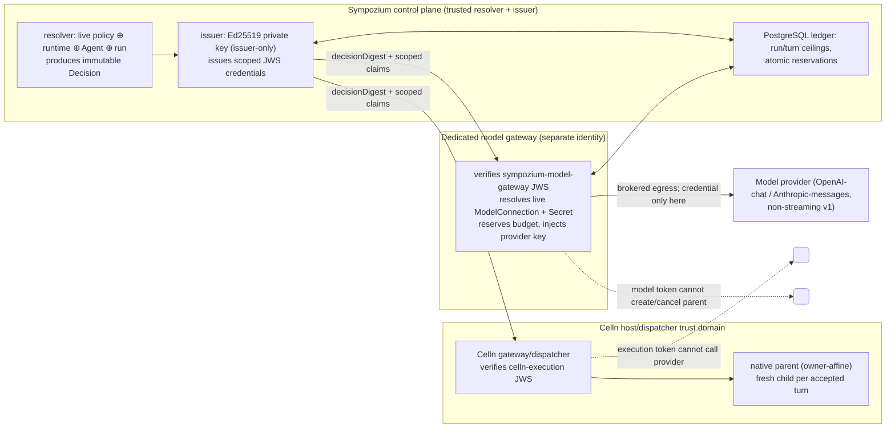
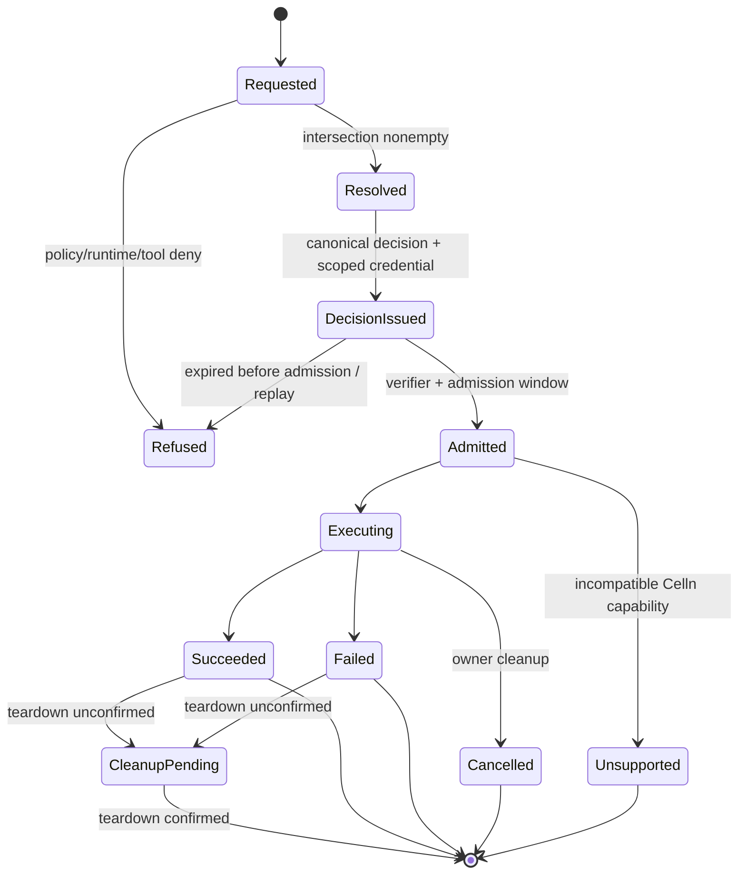

# Celln namespace authorisation, lifecycle and cross-repository conformance contract

Status: **v1 contract — frozen for review under epic #495 / issue #496.**
This document specifies authority, lifecycle and accounting semantics. It is not
an implementation. No execution-plane runtime change is described as delivered
by this contract. Enforcement owners are recorded per check in §10 so downstream
issues (#497–#509) implement to one protocol rather than inventing one each.

Repository revisions inspected while authoring this contract:

| Repository | Revision | Notes |
| --- | --- | --- |
| `sympozium-ai/sympozium` | `b66fcd1b1bf084c8e2b406cc64ebfe9e100c2b3e` | HEAD of the contract branch base |
| `sympozium-ai/celln` | `e715c3a2847886caa5add4966e75cfa8374b2d8f` (release 0.5.10) | static bearer-token parent auth; no JWS/audience |

The local working copies of Celln available to the author do not contain
`crates/celln-cli/src/{dispatch_harness_issuer,dispatch_parents,router_parents}.rs`
and are pinned to Celln `0.4.13`. The referenced upstream revision was inspected
through the GitHub API instead. See §12 for the recorded incompatibilities.

The normative fixture set for this contract is
[`test/fixtures/celln-authorisation/v1/`](../../test/fixtures/celln-authorisation/v1/).
The manifest and bundle digest are the shared, pinned input for the Celln
consumer. Do not copy or re-derive those expectations independently.

---

## 1. Scope and non-goals

This contract covers the authorisation decision, the scoped credentials derived
from it, the lifecycle state machines for one-shot and enduring work, and the
durable model-gateway accounting protocol. It does **not** implement the
resolver, the issuer, the Celln admission path, the model gateway, the ledger or
the installation. Those are #497–#506. A merged contract is not installed
functionality.

Non-goals (carried verbatim from #495): parent migration/checkpoint recovery,
additional execution planes, arbitrary OCI/Python support, namespace
fairness/quota scheduling, ServiceAccount impersonation/delegation, parent lease
extension, budget top-ups, live widening of authority, general secret
delegation, and fleet-wide instantaneous revocation.

Cryptographic identity does **not** prove physical host isolation. The
cell/KVM/VM boundary is a Celln property; this contract only binds identity and
authority.

---

## 2. Terms

| Term | Meaning |
| --- | --- |
| **Run** | The original `AgentRun` identity: namespace name+UID, AgentRun UID and immutable spec digest. Stable across turns, tokens and restarts. |
| **Turn** | One accepted unit of enduring work. Each turn has a fresh decision, not a fresh run or budget. |
| **Decision** | The canonical authorisation document (payload of §5). Immutable for its operation. |
| **Credential** | The Ed25519 JWS compact serialisation that carries a decision digest and scoped claims. Bearer material; never persisted in CRs, logs, Secrets or URLs. |
| **Permit** | An already-issued credential admitted inside its admission window. |
| **Admission window** | The bounded interval after issuance in which a permit may be admitted (default 60 s). |
| **Work deadline** | The immutable deadline of admitted work, derived from the parent lease / turn budget. |
| **Budget ID** | The stable identity of the durable run/turn accounting rows. Never recreated for a new token. |
| **Contraction** | A policy change that reduces authority. Revalidation refuses new authority; it does not retroactively cancel admitted bounded work. |

---

## 3. Trust and credential diagram



Rules:

* Signing private keys stay with the issuer. Verifiers receive only trusted
  public keys (configured `kid` set; no remote key URLs).
* The issuer signs both audiences. A credential for one audience is rejected by
  the other. Neither can independently expand authority.
* The control-plane transport bearer is **not** execution authority. Presenting
  it to Celln or the model gateway must not bypass a run decision.
* Provider credentials live only at the model-gateway/provider custody
  boundary. They are never written to tenant Secrets, CR specs/status, events,
  logs, URLs, Helm values or a shared credential file.

---

## 4. Decision schema

A decision is a JSON object. It is canonically encoded with **RFC 8785 JSON
Canonicalization Scheme (JCS)** before hashing or signing. The JSON Schema is
[`schema/decision.schema.json`](../../test/fixtures/celln-authorisation/v1/schema/decision.schema.json).

```jsonc
{
  "apiVersion": "celln.sympozium.ai/authorisation-decision-v1",
  "kind": "CellnAuthorisationDecision",

  // Stable original run identity (not per-token).
  "run": {
    "namespace": "celln-tenant-a",
    "namespaceUid": "5e...",           // namespace object UID
    "name": "run-1",
    "uid": "9f...",                     // AgentRun UID
    "specSha256": "sha256:..."          // AgentRun spec digest
  },

  // Subject the decision is issued to.
  "subject": {
    "kind": "Agent",                    // Agent | AgentRuntime | AgentRun
    "namespace": "celln-tenant-a",
    "name": "agent-1",
    "uid": "a1...",
    "specSha256": "sha256:..."
  },

  "operation": "execution.start",       // see §7
  "lifecycle": "one-shot",              // one-shot | enduring-initial | enduring-turn

  "parent": null,                       // or {"incarnation":"blake3:...","turnId":"t1"}

  "runtime": {
    "name": "runtime-1",
    "uid": "b2...",
    "revision": "rev-1",
    "specSha256": "sha256:..."
  },

  "agent": { "name": "agent-1", "uid": "a1...", "specSha256": "sha256:..." },

  "policy": {
    "profile": "prof-1",                // operator-configured profile name
    "revision": "policy-rev-7",
    "digest": "sha256:..."
  },

  // Ordered, meaningful array of approved tool revisions (v1: 0..16, §4.4).
  "tools": [
    {
      "name": "k8s-read",
      "revision": "rev-3",
      "hash": "blake3:...",             // immutable artifact identity
      "limits": { "timeoutMillis": 30000, "memoryBytes": 67108864,
                  "taskBytes": 4096, "outputBytes": 65536, "workspace": "none" }
    }
  ],

  "route": {
    "modelConnectionUid": "c3...",      // null for no-auth local routes
    "modelConnectionSpecSha256": "sha256:...",
    "provider": "openai",
    "protocol": "openai-chat",          // openai-chat | anthropic-messages
    "model": "gpt-4o-mini",
    "endpointOrigin": "https://api.openai.com",
    "streaming": false,                 // v1 mediated path: must be false
    "credentialSource": {               // pinned by UID/name/key, never read by resolver
      "kind": "ModelConnection",
      "secretUid": "d4...",
      "secretName": "openai-key",
      "secretKey": "apiKey"
    }
  },

  "budget": {
    "budgetId": "sha256:...",           // stable across tokens/turns/restarts
    "runCap":     { "requests": 6, "outputTokens": 3072 },
    "turnCap":    { "requests": 2, "outputTokens": 512 },
    "deadlineUnix": 1790000123
  },

  "windows": {
    "issuedAt":   1790000000,           // iat
    "notBefore":  1790000000,           // nbf
    "expiry":     1790000123,           // exp; must be <= deadlineUnix
    "admissionDeadline": 1790000060     // issuedAt + 60; permits usable until here
  },

  // Non-self-referential binding: hash over this decision with requestBinding
  // set to "" and no credential material. Excludes only that self-reference.
  "requestBinding": "sha256:..."
}
```

### 4.1 Canonical encoding (RFC 8785)

* Keys sorted by UTF-16 code units, no insignificant whitespace, UTF-8 output.
* Numbers are restricted to integers in the inclusive JSON-safe range
  `[-2^53+1, 2^53-1]`. Floats, exponents and `-0` are forbidden in decisions
  and are refused. This removes the only class of cross-language JCS
  disagreement that matters here.
* Strings use the JSON escape set required by RFC 8785 (control characters,
  `"` and `\`; `/`, `<`, `>`, `&` are **not** escaped). Non-ASCII is emitted as
  UTF-8.
* `null` and absent fields are distinct. A field declared optional may be
  `null` only where the schema says so (`parent`, `route.modelConnectionUid`).
  Optional fields must be present as `null` when not applicable so the
  canonical bytes are unambiguous.
* Tool arrays are ordered and meaningful. Reordering is a different decision.

### 4.2 Digests

* `decisionDigest = "sha256:" + hex(SHA256(canonical decision bytes))`. It is a
  credential claim (§5); it is **not** stored inside the decision (avoids
  self-reference).
* `requestBinding = "sha256:" + hex(SHA256(canonical decision with
  requestBinding = ""))`. It covers persona/task/artifact/model/limit fields.
  It excludes only the binding field itself and credential material.
* SHA-256 is used for contract digests even though current Celln closure/mote
  hashes use BLAKE3. The incompatibility is recorded in §12.
* Integer fields are signed 64-bit decimal integers; every digest is a typed
  `sha256:` (or `blake3:` for upstream artifact ids) prefixed lowercase hex.

### 4.3 Run identity versus per-operation decisions

* The original run identity (`run`) and `budget.budgetId` are stable for the
  whole run.
* Every accepted turn gets a **fresh** `decisionId`/credential with a fresh
  `jti`, its own windows and its own `budget.turnCap`, but it inherits the
  original `run`, `budget.runCap`, `budget.budgetId` and (for enduring) the
  `parent.incarnation`.
* A token refresh must not refresh admission/deadline nor manufacture another
  accepted turn. Admission is counted against the original ceiling.
* `decisionId` is not stored as a field to avoid a self-reference; verifiers use
  `decisionDigest`.

### 4.4 Bounds (measured against the worst-case 16-tool fixture)

| Item | Bound | Notes |
| --- | --- | --- |
| Tools per decision | 0..16 | empty is valid (model-free direct or explicit tool-free) |
| Decision canonical bytes | ≤ 262144 (256 KiB) | `AUTH_DECISION_SIZE_EXCEEDED` |
| Credential compact JWS bytes | ≤ 32768 (32 KiB) | `AUTH_CRED_SIZE_EXCEEDED` |
| Credential claims JSON bytes | ≤ 65536 (64 KiB) | `AUTH_CRED_SIZE_EXCEEDED` |
| Task/persona text | existing `taskBytes`/2048 ceilings | from runtime profile |
| JWS protected header | ≤ 1024 bytes | `AUTH_CRED_HEADER_SIZE` |
| `kid` | 1..64 chars `[A-Za-z0-9_-]` | configured set only |
| `jti` | 16..128 chars, base64url or UUID | unique per issued credential |
| Tool name/revision | 1..253 / 1..128 | DNS-ish, schema-restricted |

---

## 5. Credential format (JWS compact, Ed25519)

A credential is a compact JWS `BASE64URL(protected) . BASE64URL(payload) .
BASE64URL(signature)` per RFC 7515, signed per RFC 8037 (`alg = "EdDSA"`, Ed25519).

Strict parsing is mandatory (fail closed):

* Exactly three non-empty segments, base64url without padding, no whitespace.
* The protected header is a JSON object with **exactly** the allowed fields:
  `alg`, `typ`, `kid`. Unknown fields, duplicate keys, `crit`, `jwk`, `jku`,
  `x5u`, `x5c`, `b64` and any remote key reference are refused.
* `alg` must be `EdDSA`. `typ` must be `celln-authorisation+jws`.
* `kid` must match a configured, active public key. Rotation keeps the old key
  verifiable for the declared admission window; an unknown `kid` is refused.
* The payload is a JSON object with **exactly** these claims:

```jsonc
{
  "apiVersion": "celln.sympozium.ai/authorisation-credential-v1",
  "iss": "sympozium-control-plane",     // fixed issuer
  "aud": "celln-execution",             // or sympozium-model-gateway
  "iat": 1790000000,
  "nbf": 1790000000,
  "exp": 1790000123,
  "jti": "b64url-or-uuid",
  "decisionDigest": "sha256:...",
  "budgetId": "sha256:...",
  "operation": "execution.start",
  "subject": { "runUid": "9f...", "turnId": null, "parentIncarnation": null }
}
```

* The payload is bounded and parsed with duplicate-key and unknown-field
  rejection.
* `aud` is single-purpose and must equal the audience required by `operation`
  (§7). A model token cannot create/cancel a parent; an execution token cannot
  call a provider.
* The verifier recomputes `decisionDigest` over the canonical decision bytes it
  holds (or receives) and refuses a mismatch.
* The verifier cross-checks `operation`, `budgetId`, `aud` and `subject` against
  the decision. A credential cannot name a different decision or expand it.
* Time: `nbf ≤ now + 5` and `exp > now - 5` (clock skew 5 s). `iat ≤ now + 5`.
  Admission additionally requires `now ≤ windows.admissionDeadline + 5`.
* Unique `jti` and `decisionDigest` are enforced for replay suppression in the
  ledger; a duplicate accepted request returns the original outcome (409 on
  identity conflict, never a second execution).

A worked example of an allowed credential (test-only key) and its canonical
decision lives in the fixture set. Fixture keys are **explicitly
non-production** and are documented as such in
[`signing/README.md`](../../test/fixtures/celln-authorisation/v1/signing/README.md).

---

## 6. Source identity and pinning rules

1. **Namespace binding.** `run.namespace`/`run.namespaceUid` and
   `subject.namespace` must agree with the live namespace UID. A renamed or
   recreated namespace fails. Label selectors used for eligibility rely on
   labels tenants cannot modify under the supported RBAC model.
2. **Pinned object identity.** `Agent`, `AgentRuntime`, `AgentRun`, `CellnTool`,
   policy/profile and `ModelConnection` each bind namespace, name, UID and spec
   digest. A same-name object with a different UID is a different object and
   refuses. Recreating a pinned object requires a new authorisation and cannot
   silently retarget an active run.
3. **Route binding.** Provider, protocol, model, endpoint origin, streaming flag
   and `ModelConnection` UID/spec digest are pinned. Tenant-authored endpoints
   or labels are not independent authorisation.
4. **Credential-source binding.** The resolver binds `kind`/Secret UID/name/key
   without reading contents. During authenticated initial registration the model
   gateway pins the actual Secret UID/name/key and returns only non-secret
   binding metadata. Credential **data** may rotate within the same authorised
   Secret UID; a deleted/recreated Secret or a changed route does not silently
   retarget. The gateway revalidates the live route/source before provider
   admission and refuses on authority-read failure.
5. **No-auth local routes.** A local route with no credential source sets
   `route.credentialSource = null` and `route.modelConnectionUid = null` (or an
   authorized ModelConnection marked no-auth), and is admitted only by explicit
   operator policy. It must still satisfy endpoint/protocol/model binding.
6. **One resolved decision.** Resolution intersects platform policy, reviewed
   runtime/tool constraints, namespaced runtime attenuation, Agent defaults and
   the explicit run request. Omission grants nothing. A requested capability
   absent from the intersection denies. An intentionally tool-free request
   remains valid when the workload is otherwise allowed.
7. **ServiceAccount identity is not proven** by a `serviceAccountName` in a CR.
   ServiceAccount-specific delegation is out of scope until every creation path
   (direct Kubernetes writes and controller-generated runs) has authenticated,
   tamper-resistant attribution.

---

## 7. Operations, audiences and endpoint matrix

| Operation | Audience | Celln endpoint(s) | Online authority needed? | Work bounded by |
| --- | --- | --- | --- | --- |
| `execution.start` (direct, model-free) | `celln-execution` | `POST /v1/executions` | yes (resolver + admission revalidation) | work deadline, run cap |
| `execution.start` (Harness one-shot) | `celln-execution` | `POST /v1/executions` | yes | work deadline, run cap |
| `execution.turn` (initial/subsequent) | `celln-execution` | `POST /v1/parents`, `POST /v1/parents/{id}/turns` | yes for admission; issued permit usable within window | parent lease, turn deadline, run cap |
| `execution.read` (status/results/audit/turn read) | `celln-execution` | `GET /v1/executions/{id}`, `GET .../audit`, `GET /v1/parents/{id}`, `GET /v1/parents/{id}/turns/{turn}` | bounded existing lease | decision windows |
| `execution.cancel` / `stop` | `celln-execution` | `POST /v1/executions/{id}/cancel`, `POST /v1/parents/{id}/stop|cancel`, `POST .../turns/{turn}/cancel` | owner-bound cleanup permission (independent of expiry) | cleanup permission, not execution permit |
| `execution.cleanup` | `celln-execution` | teardown/cancel/stop | owner-bound cleanup permission | cleanup window |
| `model.invoke` | `sympozium-model-gateway` | model gateway `/v1/model/*` (internal) | yes (gateway revalidates) | turn deadline, budget reservation |
| `budget.register` | `sympozium-model-gateway` | model gateway registration (trusted issuer only) | issuer-only | immutable ceilings |
| `budget.inspect` | `sympozium-model-gateway` | model gateway inspection | yes | read-only |
| no-auth local model | `sympozium-model-gateway` | model gateway local route | operator policy | turn deadline |

`operation` determines the required audience. No other audience combination is
accepted. Transport credentials are never accepted as substitutes.

---

## 8. Lifecycle state machines

### 8.1 One-shot (direct model-free and Harness one-shot)



Direct model-free one-shot has **no model requirement**: no `model.invoke`,
no budget registration. Harness one-shot receives a bounded execution permit
**plus** model authority (a second credential with the model audience). No Job
fallback is permitted when Celln is selected and refuses.

### 8.2 Enduring (native parent)

```mermaid
stateDiagram-v2
  [*] --> ParentRequested
  ParentRequested --> ParentRefused: policy/runtime deny
  ParentRequested --> ParentAdmitted: verify parent-create credential
  ParentAdmitted --> ParentActive: exactly one live parent/incarnation
  ParentActive --> TurnAdmitted: fresh decision + execution permit (initial counts)
  TurnAdmitted --> TurnRunning: one active turn per parent in v1
  TurnRunning --> TurnCommitted: result/checkpoint committed
  TurnCommitted --> ParentActive
  ParentActive --> StopRequested
  StopRequested --> Closed: terminal/closing fence + teardown confirmed
  ParentActive --> ContextLost: owner death; never silent recreation
  TurnRunning --> ContextLost: owner death
  ContextLost --> Closed: honest reporting; no recreation
  ParentActive --> CleanupPending: owner-bound cleanup during outage
  TurnRunning --> CleanupPending
  CleanupPending --> Closed
  Closed --> [*]
```



* Initial task counts toward `maxTurns`. One active turn per parent in v1.
* Fresh disposable child per accepted turn; the parent is the only live
  incarnation.
* Stop/cleanup use a terminal/closing fence and a separate owner-bound cleanup
  permission, not a reusable execution credential.
* Revalidate live policy and pinned identities before initial admission and
  every externally submitted turn. API/policy-read failure refuses new
  authorisation. The parent cannot authorise its own renewal.

---

## 9. Admission, revocation and accounting semantics

### 9.1 Windows

* Default admission window: **60 s** from `issuedAt`; verifier clock skew:
  **at most 5 s**.
* Already-issued permits may be admitted inside the window even if policy was
  withdrawn after issuance. This is **not** instantaneous revocation.
* Once admitted, work is bounded by its immutable turn deadline, parent lease
  and remaining aggregate budgets. Model credentials expire no later than the
  turn deadline.
* Reissuing a credential for an uncertain operation does not extend the
  original admission/work deadline. Lease extension and budget top-up are out
  of scope for v1.
* New turns get new decisions but never extend the parent lease or refill
  budgets.

### 9.2 Fail-closed behavior

| Condition | Behavior |
| --- | --- |
| Policy/object read fails | refuse new authorisation (`AUTH_AUTHORITY_UNAVAILABLE`, 503) |
| Verification key unavailable | refuse (`AUTH_CRED_KEY_UNAVAILABLE`, 503) |
| Ledger unavailable | refuse new model admission; do not fall back to in-memory (`AUTH_ACCOUNTING_UNAVAILABLE`, 503) |
| Clock rollback detected (verifier clock behind `iat` by > 5 s) | refuse (`AUTH_TIME_SKEW_EXCEEDED`) |
| Duplicate delivery | return original outcome or explicit uncertainty; never a second execution |

### 9.3 Ledger operations (model gateway)

Only the trusted issuer may create or raise a budget row. A presented model
token cannot create or raise a budget row.

1. `register` — immutable run/turn ceilings from the issuer. Idempotent on
   `(budgetId, runUid)`; a conflicting re-register is `409`.
2. `reserve` — atomically reserve one request **and** the permitted
   output-token ceiling **before** contacting the provider. V1 reservations are
   non-refundable once committed. `429 AUTH_BUDGET_EXHAUSTED` on failure.
3. `reconcile` — record observed usage separately from reserved usage. An
   ambiguous provider outcome is recorded as uncertain and is **never**
   automatically replayed.
4. `close`/`fence` — terminal fence/tombstone retained through credential and
   retry windows.
5. `inspect` — read-only; used for reconciliation and audit.

Restoring older accounting state requires fencing outstanding authority rather
than reopening spent budgets. Output-token limits do **not** claim to bound
input-token cost or total money spent.

---

## 10. Check ownership, online authority and error catalogue

### 10.1 Ownership table

Every fixture check is assigned to exactly one enforcement owner. "Resolver"
and "issuer" are Sympozium control-plane components; "Celln" is the
gateway/dispatcher; "Gateway" is the dedicated model gateway; "Ledger" is the
PostgreSQL accounting store.

| Check / reason family | Owner | Requires online authority? |
| --- | --- | --- |
| Decision schema + canonical encoding + digests | Resolver / issuer | no (deterministic) |
| Namespace/UID/spec/route/tool pinning | Resolver | yes (live reads) |
| Policy intersection/contraction/removal | Resolver | yes (live reads) |
| Limit ranges and empty selection | Resolver | no once read |
| JWS strict parse, `alg`/`kid`/header bounds | Celln + Gateway (shared verifier) | no (public keys configured) |
| Issuer, audience, `jti`, time windows | Celln + Gateway | no (bounded lease); admission revalidation online |
| `decisionDigest` / claim-vs-decision binding | Celln + Gateway | no |
| Execution operation/serialisation | Celln | admission revalidation online |
| Parent incarnation/turn binding | Celln | admission revalidation online |
| Model route/credential-source binding | Gateway | yes before provider admission |
| Streaming/unsupported protocol refusal | Gateway | no |
| Budget register/reserve/reconcile/fence | Ledger (via Gateway) | yes |
| Stop-vs-new-work fence + cleanup permission | Celln | owner-bound; works after execution expiry |
| Duplicate/replay suppression | Ledger + Celln (ownership ledger) | yes |

Checks that use only a bounded existing lease must still fail closed when the
verifier cannot read its configured public keys. Checks requiring online
authority fail closed when the authority read fails. This contract does not
claim cryptographic identity proves physical host isolation.

### 10.2 Error catalogue (stable reason codes)

| Code | HTTP | Meaning |
| --- | --- | --- |
| `AUTH_CRED_MALFORMED` | 400 | not exactly three base64url segments / bad JSON |
| `AUTH_CRED_DUPLICATE_JSON_KEY` | 400 | duplicate key in header or payload |
| `AUTH_CRED_UNKNOWN_FIELD` | 400 | unknown header/payload field |
| `AUTH_CRED_HEADER_SIZE` | 400 | protected header exceeds bound |
| `AUTH_CRED_SIZE_EXCEEDED` | 400 | compact JWS or payload exceeds 32/64 KiB |
| `AUTH_CRED_ALG_UNSUPPORTED` | 401 | `alg` not `EdDSA` |
| `AUTH_CRED_TYP_UNSUPPORTED` | 401 | `typ` not the contract type |
| `AUTH_CRED_KID_UNKNOWN` | 401 | `kid` not in configured active/rotation set |
| `AUTH_CRED_SIG_INVALID` | 401 | Ed25519 verification failed |
| `AUTH_CRED_KEY_UNAVAILABLE` | 503 | configured verification key unreadable |
| `AUTH_ISS_MISMATCH` | 401 | `iss` is not the fixed issuer |
| `AUTH_AUD_MISMATCH` | 403 | audience not valid for operation |
| `AUTH_OPERATION_MISMATCH` | 403 | claim operation differs from decision |
| `AUTH_SUBJECT_MISMATCH` | 403 | claim subject differs from decision/run |
| `AUTH_TIME_NOT_YET_VALID` | 401 | `nbf` in the future beyond skew |
| `AUTH_TIME_EXPIRED` | 401 | `exp` in the past beyond skew |
| `AUTH_TIME_SKEW_EXCEEDED` | 401 | clock rollback / skew > 5 s |
| `AUTH_ADMISSION_WINDOW_EXPIRED` | 403 | permit outside admission window |
| `AUTH_DECISION_DIGEST_MISMATCH` | 403 | recomputed digest differs |
| `AUTH_REQUEST_BINDING_MISMATCH` | 403 | recomputed non-self-referential request binding differs |
| `AUTH_VERSION_UNSUPPORTED` | 400 | unknown `apiVersion` |
| `AUTH_DECISION_SIZE_EXCEEDED` | 400 | canonical decision exceeds 256 KiB |
| `AUTH_NAMESPACE_UID_MISMATCH` | 403 | namespace name/UID mismatch |
| `AUTH_RUN_UID_MISMATCH` | 403 | run UID/spec identity mismatch |
| `AUTH_PARENT_TURN_MISMATCH` | 403 | parent incarnation/turn identity mismatch |
| `AUTH_ROUTE_MISMATCH` | 403 | model route/provider/protocol/model endpoint mismatch |
| `AUTH_CREDENTIAL_SOURCE_MISMATCH` | 403 | Secret UID/name/key mismatch or retarget |
| `AUTH_CREDENTIAL_SOURCE_DELETED` | 403 | pinned credential source deleted/recreated |
| `AUTH_BUDGET_MISMATCH` | 403 | budget id/ceiling binding mismatch |
| `AUTH_BUDGET_EXHAUSTED` | 429 | atomic reservation would exceed a ceiling |
| `AUTH_BUDGET_REGISTER_CONFLICT` | 409 | immutable ceiling re-register conflict |
| `AUTH_DUPLICATE_DECISION` | 409 | `jti`/digest already accepted |
| `AUTH_ACCOUNTING_UNAVAILABLE` | 503 | ledger unavailable; no in-memory fallback |
| `AUTH_POLICY_WITHDRAWN` | 403 | no matching allow rule / policy removed |
| `AUTH_POLICY_CONTRACTED` | 403 | effective limits exceed contracted policy |
| `AUTH_TOOL_ORDER_MISMATCH` | 403 | meaningful tool array reordered |
| `AUTH_TOOL_UNKNOWN` | 403 | tool/revision not approved |
| `AUTH_LIMIT_OUT_OF_RANGE` | 403 | zero/missing/out-of-range limit |
| `AUTH_STREAMING_UNSUPPORTED` | 400 | streaming requested on mediated v1 path |
| `AUTH_PROTOCOL_UNSUPPORTED` | 400 | protocol not `openai-chat`/`anthropic-messages` |
| `AUTH_CAPABILITY_UNSUPPORTED` | 400 | Celln capability unsupported (`Unsupported`) |
| `AUTH_AUTHORITY_UNAVAILABLE` | 503 | policy/identity read failed |
| `AUTH_CLEANUP_PENDING` | 202 | cleanup retained during outage |
| `AUTH_CONTEXT_LOST` | 410 | owner death; no recreation |

Refusal codes are stable and machine-asserted by the fixture validator.

---

## 11. Model gateway protocol (v1)

* Initial supported provider protocols: **non-streaming** `openai-chat` and
  `anthropic-messages`. Streaming requests, unsupported adapters, arbitrary URL
  overrides, credential-forwarding redirects and fallback host providers are
  explicitly refused (`AUTH_STREAMING_UNSUPPORTED`, `AUTH_PROTOCOL_UNSUPPORTED`).
  Streaming support is **not** implied by existing web-proxy functionality.
* The gateway resolves the exact authorised namespaced `ModelConnection` and
  credential source, enforces endpoint/protocol/model restrictions and brokered
  egress, and injects the provider key. Guests receive no provider sockets.
* Verified TLS is required for credential-bearing non-loopback mediated
  traffic. Loopback / explicitly `allowInsecure` local routes follow the
  operator acknowledgement.
* Bounds: request body ≤ 1 MiB, per-request output tokens ≤ `turnCap.outputTokens`,
  deadline ≤ `budget.deadlineUnix`. Unknown/ambiguous provider outcomes are not
  retried automatically.
* Credential custody blast radius is documented honestly: cluster-wide
  `get secrets` remains cluster-wide privilege despite application reference
  checks. This project does not claim to remove existing controller secret
  permissions needed by unrelated execution backends. No Secret list/watch for
  convenience.

---

## 12. Recorded incompatibilities with current implementations

These are explicit, unresolved incompatibilities between this frozen contract
and the implementations inspected at the revisions above. They are **not**
silently resolved by this document and must be addressed by the downstream
workstreams named.

| # | Incompatibility | Current behavior | Owner issue |
| --- | --- | --- | --- |
| I1 | **Static bearer credentials, no JWS.** | Celln `0.5.10` authenticates `/v1/executions` with `--token-file` and `/v1/parents` with an operator token-hash file (`dispatch_parents.rs` compares `token_hash` with constant-time equality). `router_parents.rs` forwards a single parent bearer and requires it to differ from client/backend/capability tokens. There is no Ed25519 JWS, `kid`, `jti`, audience or decision digest. | #500, #501 (paired Celln PRs) |
| #2 | **No audience separation.** | Sympozium's `internal/celln.Config.TokenFile` sends one bearer for both lifecycles; Celln has no `celln-execution` vs `sympozium-model-gateway` distinction. | #499, #501, #502 |
| #3 | **No canonical encoding agreed.** | Current code hashes Go `encoding/json` output (`cellnauthority`) and Rust `serde_json::to_vec` (`dispatch_harness_issuer.rs`). These are not RFC 8785 JCS and can differ (key order, escaping, whitespace). `decisionDigest`/`requestBinding` are therefore not reproducible cross-language today. | #496 (this contract), consumed by #499 |
| #4 | **Hash family mismatch.** | Sympozium run/subject digests use `sha256:`; Celln `Hash::of` and closure/mote/incarnation use `blake3:`. This contract uses `sha256:` for decision/budget digests and `blake3:` only for upstream artifact ids. Cross-repo comparisons must translate explicitly, not assume equality. | #498, #500, #501 |
| #5 | **No durable budget ledger.** | Current `ModelPolicyDocument`/`dispatch_harness_issuer.rs` enforce `maxRequests`/`maxTotalOutputTokens` from an operator profile. There is no PostgreSQL atomic reservation/accounting and no per-run/per-turn budget row. | #503 |
| #6 | **No dedicated model gateway.** | Current model mediation runs inside the Celln issuer profile and the general `web-proxy`. The `web-proxy` already supports streaming and arbitrary endpoints; reusing it as the mediated gateway without restriction is forbidden. | #502 |
| #7 | **No per-turn decision binding.** | Current Celln parent auth binds a static token; `CellnParentBinding` pins run UID/spec/launch profile/incarnation but not policy/tool/route/budget digests. The epic's turn decisions exceed current parent admission. | #498, #500, #505 |
| #8 | **Credential-source rotation semantics absent.** | `modelconnection.Resolve` pins a `ConnectionRevision` (UID+spec) and `CredentialProfile`, and `ResolveHarness` requires a Kubernetes Secret. There is no gateway-side live revalidation of a deleted/recreated Secret UID at provider admission. | #502, #503 |
| #9 | **No no-auth local model route contract.** | `modelconnection.Resolve` requires a `CredentialProfile` for native connections; `ResolveHarness` rejects `CredentialProfile`. The contract's explicit no-auth local route is not represented yet. | #497, #502 |
| #10 | **Fixture keys are non-production.** | This contract ships deterministic Ed25519 test keys so fixtures are reproducible. They must never be trusted in a cluster. Celln's consumer must pin the public key by `kid` and reject the test issuer outside conformance tests. | #496, #506 |

Missing KVM is irrelevant to this contract-only task. No runtime, installed or
security-acceptance claim is made by this document.

---

## 13. Shared fixture set and bundle pin

Path: `test/fixtures/celln-authorisation/v1/`.

* `manifest.json` — the authoritative list of vectors, categories, expected
  reason codes and the pinned bundle hash.
* `schema/decision.schema.json`, `schema/credential.schema.json` — JSON Schema
  2020-12.
* `signing/test-jwks.json`, `signing/test-private-keys.json` — explicitly
  non-production Ed25519 vectors.
* `vectors/<name>/{decision.json,decision.canonical,decision.digest,credential.jws,observed.json,expect.json}`.
* `bundle/SHA256SUMS` — SHA-256 of every committed fixture file.
* `bundle/BUNDLE.sha256` — SHA-256 of the sorted `SHA256SUMS` manifest. This is
  the pinned shared fixture hash for Celln's consumer.

The Celln consumer must vendor this bundle by hash and must not maintain an
independently evolving copy of the expectations. Any contract change updates
the schemas, vectors, `SHA256SUMS` and `BUNDLE.sha256` together, in review.

The fixture validator lives at `cmd/celln-authorisation-fixture` and is run
with one documented command (see the fixture README). It validates the schema,
recomputes canonical bytes and digests, verifies Ed25519 signatures against the
test JWKS, runs the named semantic checks, and asserts each negative case fails
for its named reason while every positive case is accepted.
